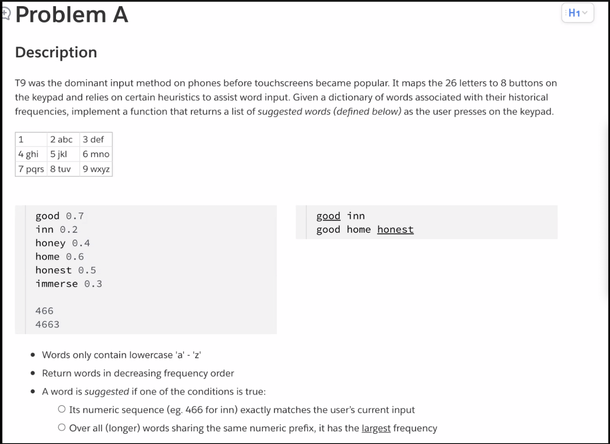

# Singularity Data 一二面

> 2022.2.18 Singularity Data数据库内核开发工程师（听着好厉害啊）面经
>
> Ps：更新过一版简历，但是HR似乎没有及时发给面试官。。。

## 一面

自我介绍。

聊项目：编译器介绍一下

> 从前端说到后端，再到垃圾回收

讲一下垃圾回收算法

讲一下LSMDB

怎么compaction的？

写密集型compaction赶不上写入了怎么办？

> 我们是单线程的，就是等到compaction完了再插入下一个。。。

讲一下你这个research主要是做什么？

做题

> 我共享屏幕，直接用自己的IDE写。



全程优化了非常多次：

先写了个最基础的Trie树，节点就是

```c++
struct TreeNode {
  vector<TreeNode *> children(26, nullptr);
  bool is_end;
};
```

然后面试官问你的时间复杂性怎么样呢？

这样的话比如搜466就要搜 `3^3=27` 个组合，然后n个字符串就是`3^n`（好一个指数复杂度。。。

然后我说可以每个点只存数字，但这样要改一下插入的逻辑，要写一个letter到int的map。

```c++
struct TreeNode {
  vector<TreeNode *> children(8, nullptr);
  vector<pair<string, double>> value;
};
```

然后写写写，prefix的解决方案就用dfs。

然后他又问，prefix可以不用dfs吗？比如输入466不用遍历到叶子就知道good。

思考了一下觉得可以，然后才发现对于prefix只要输出frequency最高的就行了。

但这样要改插入的逻辑巴拉巴拉。反正最后搞出来了。

然后他说挺好的，把代码发我一份吧。（是写得太好了还是他要帮我debug呀x

## 二面

自我介绍。

讲Compiler（这个面试官感觉比较厉害）

Tiger语言有什么功能？

> 就记着个嵌套函数了。

寄存器不够怎么办？

> 说了一下寄存器分配的时候如何处理溢出。

怎么垃圾回收的？

讲一下LSMDB吧。

从内存说到disk。然后主要说了一下compaction。

写密集型怎么办？（跟一面一样）

你的ProgreSQL拼错了。。。az

介绍一下你的research吧？

> 大厂就没问过我放在最前面这个research experience。。。

这两个web开发也都是课程项目吗？

做题吧：

给四个点，判断是不是正方形。

`bool isSquare(pair<int, int> &p1,...,&p4)`

写得很挣扎。。。不想回忆了。

最后在他的不断提示下采用方向向量减少了一点工作量。

最后他说他见到最简单的做法：

直接6条变长算出来做个聚类，如果4，2就一定是正方形。再不行做个判断判一下长度是不是$\sqrt {2} : 1$

> zsp提供了一种思路：先算重心，然后到四点距离相等（此时共圆了），然后一个点算一下根据重心的对称点，把这一对点挪掉。然后再下一对点。最后再判一下长方形。